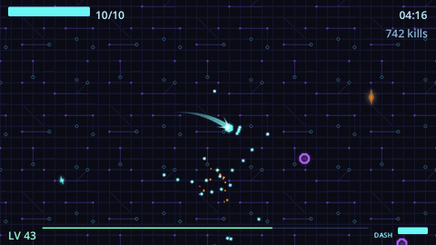

# BESTAGON

A micro arena survivor built in Godot 4.7.1 and GDScript. Move; your weapons fire themselves. Every
third level you pick one upgrade out of three. Survive five minutes and beat what shows up and you
have won — keep going, and something worse arrives at ten.



*Four minutes in, level 43, 742 kills. Captured from a real run with the in-repo screenshot
tool — `--shot-frames` writes a contact sheet, and the frames are sliced back out into this loop.*

**No third-party assets.** The sprites are drawn procedurally by a Python script
(`tools/gen_assets.py`). The soundtrack is **written** — 38 original pieces, ~1,125 lines of
[Strudel](https://strudel.cc) pattern code in `audio_src/`, including the four-stem adaptive
structure that lets the music follow the fight without ever restarting. The renderer is a compiler,
not a composer. See [`assets/ATTRIBUTION.md`](assets/ATTRIBUTION.md).

> **And regenerable from a clone, which is a stronger claim than "generated".** Sprites rebuild with
> Python and Pillow; audio rebuilds with one `npm install` (see
> [Rebuilding the audio](#rebuilding-the-audio)). Both generators are committed here, neither
> contains a path to anybody's machine, and the audio renderer is seeded — re-rendering a stem
> reproduces the committed file **byte for byte**.

> Built with Claude as a deliberate experiment in AI-assisted development: the code, the generators
> and the copy are largely LLM-written, and the design decisions, direction and playtesting are not.
> No image or audio model was used — the art and music are code.

## Play it

- **Browser** — the itch.io page (currently a restricted playtest build)
- **Windows** — a standalone `.exe`; unsigned, so SmartScreen will want "More info → Run anyway"

Controls: **WASD/arrows** move · **SPACE** dash (earned by beating the 5:00 boss) · **ESC or P**
pause · **M** mute · **R** restart.

> A web build **cannot** be run by double-clicking `index.html` — browsers refuse to fetch the
> `.wasm` and `.pck` from a `file://` page. Serve it over HTTP; the packaged zip ships a
> `START-HERE.bat` that does exactly that.

## Running it from source

You need **Godot 4.7.1 stable, standard build** — not mono, which ships no web export templates.
It is not vendored here: it is a ~120 MB binary and not ours to redistribute.
[Download it](https://godotengine.org/download), then point the scripts at it:

```powershell
$env:GODOT = 'C:\path\to\Godot_v4.7.1-stable_win64_console.exe'
```

Use the **`_console`** executable. The plain one detaches from the terminal and every line of output
is lost — which leaves the gate below unable to grep for the errors it exists to catch.

`$env:GODOT` is an override, not a requirement: the scripts also look in this workspace's `engine\`
folder and then on `PATH`. If none of them resolve, they print every location they tried and what to
install, rather than failing with a path you never wrote. (`$env:GODOT` was added after a clone of
this repo turned out to fail on all five gate stages with an error that never said "engine" —
see [`tools/find_godot.ps1`](tools/find_godot.ps1).)

```powershell
# THE GATE: error-filter self-test + absolute-path and build-artifact guards + import
# + 128 unit tests + gameplay smoke + the UI layout harness + the tween-orphan
# regression, with the error grep and the known-benign-noise list built in.
# Run this, not the pieces.
powershell -File tools/verify.ps1
powershell -File tools/verify.ps1 soak      # + an 11-minute run clearing both boss events

# build and package both platforms for release
powershell -File tools/package.ps1
```

A fresh clone with nothing but `$env:GODOT` set runs the whole gate green from cold — that is
checked by actually doing it, not assumed.

Success is **exit 0 AND no `SCRIPT ERROR`/`ERROR` in stdout** — Godot's exit codes do not reliably
reflect script failures, so the gate greps.

### Rebuilding the audio

Only needed if you want to **change** the music or SFX — the `.ogg` files the game plays are
committed.

```powershell
cd tools/strudel; npm install; cd ../..    # once per clone, a few seconds
python tools/build_music.py                # re-renders whatever changed
python tools/build_sfx.py
```

The renderer ships in [`tools/strudel/`](tools/strudel/) — Strudel pattern code to `.wav`, headless
and **seeded**, so renders are byte-identical run to run. Verified: a clean install re-rendered
`victory.strudel` into a byte-for-byte copy of the committed `victory.wav`. `npm install` fetches
AGPL-3.0 packages from the registry, which this repo declares but does not redistribute
(`node_modules/` is gitignored); the boundary is written out in
[`tools/strudel/README.md`](tools/strudel/README.md). The game never links any of it — Godot plays
`.ogg` files.

`$STRUDEL_RENDERER` overrides the location if you keep a checkout elsewhere. Run either script when
it cannot resolve and it prints every path it looked in — it does not fail silently, and it contains
no absolute path to fail with. `verify.ps1` enforces that last part.

## Layout

| Path | What |
|---|---|
| `scenes/` | one folder per feature; each script sits next to its `.tscn` |
| `scripts/` | autoloads and pure utilities |
| `resources/` | game data as `.tres` — enemies, upgrades, waves. Never dictionaries or JSON |
| `assets/` | generated sprites, shaders and audio |
| `tools/` | the asset/audio/upgrade generators, the verify gate, the packaging script |
| `tests/` | GUT unit tests, pure logic only |
| `scenes/dev/` | juice lab and the UI layout harness; excluded from exports |

## Conventions

Static typing everywhere. Call down, signal up. Game data lives in Resources, never in
dictionaries. Tests cover logic, never scenes — which is why UI that must fit the 640×360 viewport
is guarded by a measuring harness (`scenes/dev/pause_layout_check.gd`) rather than by eye.

## Documents

- [`BRIEF.md`](BRIEF.md) — the spec: prime directive, what counts as a defect, acceptance criteria
- [`TODO.md`](TODO.md) — milestones and scope, the source of truth for what is done
- [`DECISIONS.md`](DECISIONS.md) — why things are the way they are, with the measurements that
  forced them

Game 1 of a three-game learning roadmap; its pick-one-of-three loop is deliberate rehearsal for a
later deckbuilder.

## Licence

[MIT](LICENSE) — code, art and music alike. Every sprite is generated and every note is composed in
this repository, so there is no third-party asset whose terms could conflict with that; see
[`assets/ATTRIBUTION.md`](assets/ATTRIBUTION.md).

One boundary worth stating rather than leaving implicit: the audio renderer in `tools/strudel/` is
ours and MIT like the rest, but `npm install` fetches **AGPL-3.0** packages from the npm registry.
This repo declares those dependencies and never redistributes them, and the game links none of them
— Godot plays `.ogg` files. Detail in [`tools/strudel/README.md`](tools/strudel/README.md).
